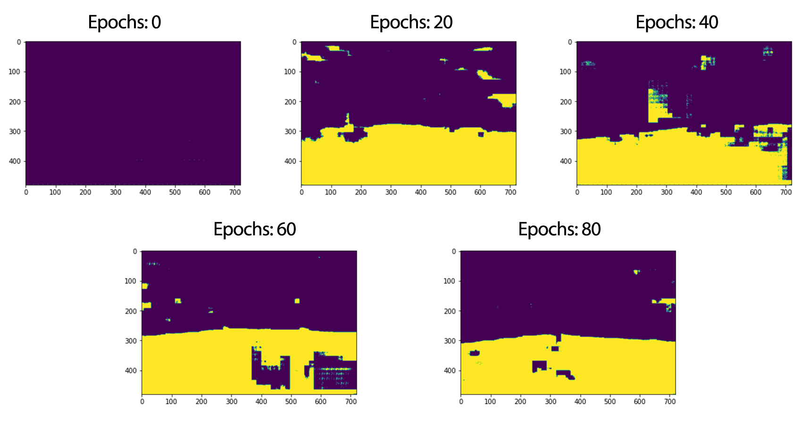
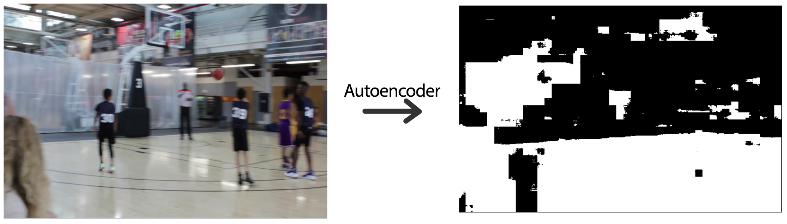
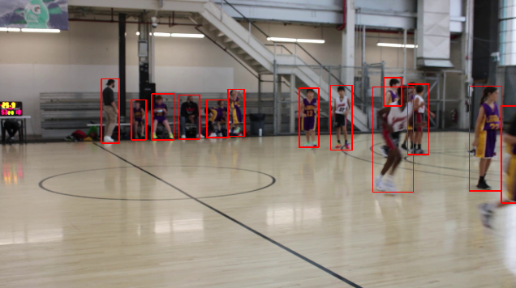
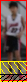
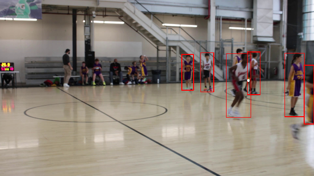

# Basketball Play Tracking

## Motivation 
I'm looking to create a tool to allow hands free recording of a general basketball game. I find, especially while recording games as a coach, that it would be convenient to just set my camera down and let the computer figure out where it should be looking. Throughout my time studying I have gained experience on everything I would need to accomplish this goal, so I figured I'd just go for it.

I got a lot of my inspiration from the study shown here (Simone Francia https://www.researchgate.net/publication/330534530_Classificazione_di_Azioni_Cestistiche_mediante_Tecniche_di_Deep_Learning). I used it as the blueprint and focused my effort into how best to reach my personal goal of tracking the focus of the play.

## Contents
[General Overview](https://github.com/ben-morehead/BasketballPlayTracking/blob/main/README.md#general-overview)

[Court Detecting Autoencoder](https://github.com/ben-morehead/BasketballPlayTracking/blob/main/README.md#court-detecting-autoencoder)

[Center of Play Detection](https://github.com/ben-morehead/BasketballPlayTracking/blob/main/README.md#center-of-play-detection)

[Live Tracking the Play](https://github.com/ben-morehead/BasketballPlayTracking/blob/main/README.md#live-tracking-the-play)

[Next Steps](https://github.com/ben-morehead/BasketballPlayTracking/blob/main/README.md#next-steps)

[Potential Improvements](https://github.com/ben-morehead/BasketballPlayTracking/blob/main/README.md#potential-improvements)

[Project Installation](https://github.com/ben-morehead/BasketballPlayTracking/blob/main/README.md#project-installation)

## General Overview
The first step for the project was finding a way of representing the center of play so that the camera can focus in on that point of view. I figured if I could find where the players were I could average their position and that would provide a fairly accurate representation of where the play is being focused. By using a pre-trained YOLO model, I could quickly detect where people in the frame were, but still had to actually differentiate who was on the court. Francia's paper came very handy here as there were already techniques in place of identifying a court in a given frame. 

Putting those pieces together lead to a set of coordinates that could represent where the camera should aim its focus. I wanted to simulate the camera movement before diving into the electronics, so I made a script that would do just that. My general approach at the moment is to get all the individual pieces working to some extent, and then improving the performance of each of those pieces. I'm hoping to have the project done by mid to late 2022.

## Court Detecting Autoencoder
#### Concept
I want to be able to take a photo of a basketball court and convert it into a bitmap representation of which pixels are/aren't the court itself. An autoencoder allows for this with relatively high accuracy as its able to break down and recreate an input frame in the format desired. The autoencoder consists of a simple convolutional encoder in series with a convolutional decoder.

> Ideal Function of the Autoencoder
> 

#### Structure
The autoencoder was adapted from Francia's paper referenced above. The kernel and stride lengths listed in the paper bring up some mathematical issues with the output dimensions of the neural network being different from the input dimensions, but with some alterations in the decoder layers I was able to get the dimensions to match up. After reworking the structure a little, I removed redundant layers to ensure optimal speed when processing datapoints.

#### Data Formatting
The neural network itself takes 720x480 tensor, which is fully formatted by the DataLoader() object that is defined in objects.py. The dataloader works in conjunction with the neural network by preparing all the dataset images for compatibility with the autoencoder object, as well as handling the batching and randomization of the dataset.

The output of the autoencoder is a 720x480 tensor which can be sent through a sigmoid function and rounded to achieve a bitmap of whether a pixel is considered "the court" or not.

#### Training Strategy
I at this point run into an issue, as I need to train the neural network despite not having a full dataset to work with. I started with about 100 images with corresponding court labels out of a full photo set of 1000 images. I wanted to make some more progress on the functionality of the project as a whole and not spend too much initial time labelling datapoints, so I decided to make the best I could out of the datapoints I had labeled. This meant tweaking batch size and epochs very mildy, as I figured it wasn't worth tuning too much without a proper and full data set. That being said I found the best results to be at 100 epochs and a batch size of 5. Shown below is a sample output at different checkpoints in the final training sequence.

> Sample Training Results
> 

#### Results
I was shockingly surprised by the accuracy that could be acquired off of such a small sample size. The model was able to detect most of the court, meaning it was functional enough to move on to the next challenge in the project. Although the model itself is not anywhere close to being ready for live video tracking on a random court with a random viewing angle, I have the infrastructure in place to easily improve on this part of the design in the future.

> Final Function of the Autoencoder
> 

## Center of Play Detection
#### Concept
Now that I have a way of differentiating who in a given frame is on the court and who is not, I just need to combine that with a person detection model to identify where players are congregated. For the person detection I did some quick research and found that Ultralytics had pre-trained YOLO models in the torch model hub, so I imported one of them and used the bounding box information from its output.

#### YOLO Output
Shown below is an example of an output of the Ultralytics YOLOv5 model. Provided in the output is a pandas dataframe that contains the information on where the bounding boxes were in the input image, the class prediction, and a confidence score.

> Sample Output of Ultralytics YOLO Model
>
>

#### Finding the Players
All that has to be done is the combination of the two models together to figure out who is on the court and who isn't. From there, the average of the center positions of the people of interest will give us our target information. It was a very quick implementation, and can be easily tweaked by adjusting the percent of matching pixels needed to be considered relevant. In the example below the yellow represents the court that does not interesect the toggle region, and the black section represents the toggle area. 

> Visualization of Intersecting Court and Player Regions
>
> 

If enough of the autoencoder "court pixels" interesect with the detection (say 90%), then we take into account that detections location in our calculation. Below is a filtered version of the yolo model output above, with the white dot marking the average player position.

> Final Filtered Image and Center of Play
> 
> 

## Live Tracking the Play
#### Parallelization
One of the costs to having to doing live event recognition is the time it takes for the computer to process the frame through several models and produce an output. In this case it takes about 0.9 seconds to produce the center of play, which causes an issue for tracking a live basketball game at 24 frames per second. To handle this I set up a basic communication path between two processes using the python library's queue object. That allowed the computer to compute the center of play, but also make adjustments to the camera at the same time. This parallelization is essential to the project functioning at live speeds.

#### Camera Simulation
The last thing I wanted to iron out was how to simulate a camera in real time. For this I just kept an internal state of what could be considered the camera's focus. The camera focus point is constantly trying to bring itself to the center of play, and this idea is going to be how the physical components behave as well. Where in the simulation we are constantly moving the camera focus laterally, in real life it will be a rotation around the tripod's axis. 

#### Results
Running this simulation by just an eye test shows the potential for a very high quality tool. The camera focus naturally moves towards the ball handler as we would hope with our average player location model. Seen below is a sample of the simulation, with the flashing red dots being new readings from the computer vision models, and the blue dot being the camera focus. The output shown was made in real time, with each frame being written as it was being read by the system.

> Sample of Live Play Tracking
>
> 

## Next Steps
- [ ] **Camera Control:** Setting up the motors and communication system between the tripod mechanism and the computer
- [ ] **Camera Tracking:** Setting up an object tracker using the motor system and live image recognition
- [ ] **Improvements:** Tackling the improvements that are known to exist to improve performance of the simulations
- [ ] **Testing:** Integrating everything and testing on some actual basketball games

## Potential Improvements
- [ ] **Autoencoder** *Data Set Size*: Need to label more datapoints and apply data augmentation techniques to better train the model
- [ ] **Autoencoder** *Hyperparameter Tuning*: With a full dataset can adjust the parameters of the autoencoder training to improve test accuracy
- [ ] **Live Tracking the Play** *Controller System*: Research control systems to aid in the camera tracing algorithm
- [ ] **Live Tracking the Play** *Introduction of Sectors*: Introduce set spots where the camera can turn to to decrease the amount of camera movement total
- [ ] **Live Tracking the Play** *Additional Processes*: Increase the number of datapoints that can be acquired from the center of play tracking algorithm

## Project Installation
*Quick Note: None of the media I used is uploaded. I have however uploaded the model checkpoint for the Autoencoder that I have been using. There are hardcoded folders in many of the scripts so in order to adapt the project to your own machine you will have to jump through a few hoops and change the directories in the files of interest. If you've seen how tricky it is to recreate and still wish to download it, here are the instructions.*

1. Clone repository
2. Install the pre-requisites (pip install -r requirements.txt)
3. You will need a Media Folder and adjustments to the PlayerDetection code to run the tests and demonstrations on your local machine.
4. run.py holds demonstration code that will walk through the different components of the project
